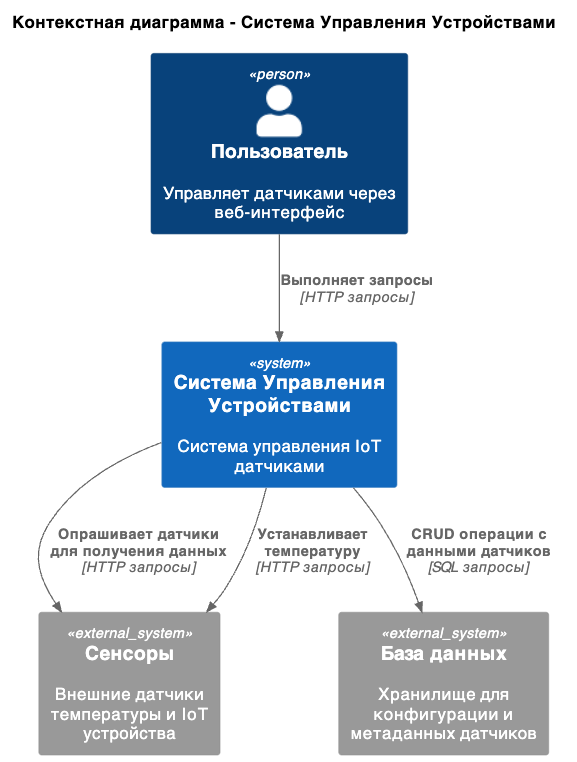
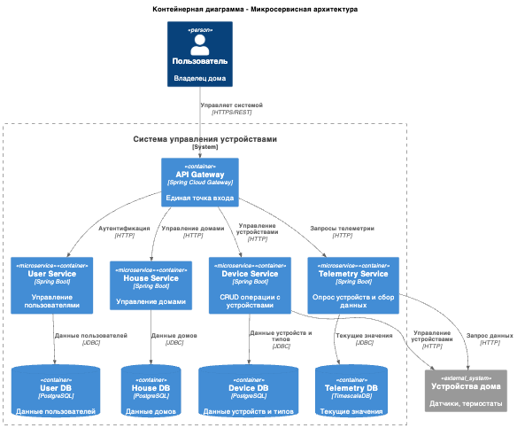
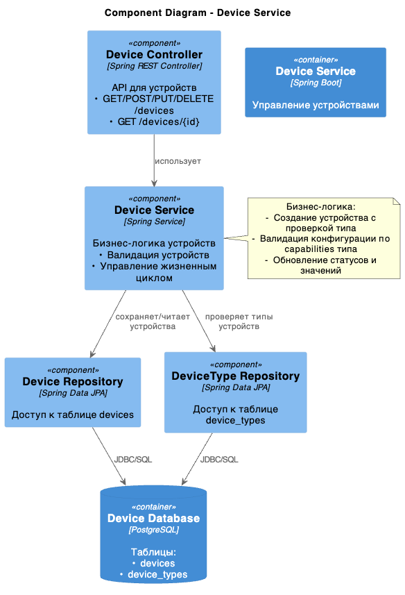
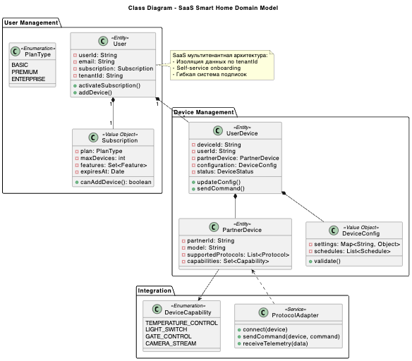
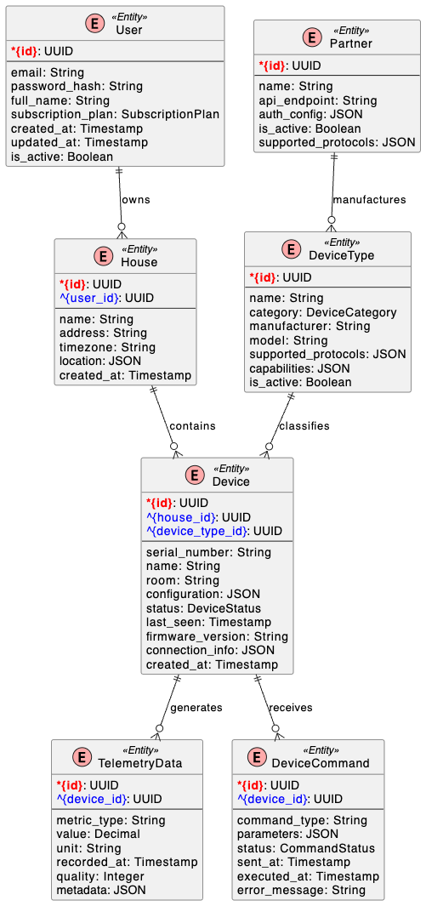

# Задание 1. Анализ и планирование

### 1. Описание функциональности монолитного приложения

**Управление отоплением:**

- Пользователи могут удалённо включать/выключать отопление в своих домах.
- Система поддерживает добавления датчиков температуры (установка сопровождается выездом специалиста)

**Мониторинг температуры:**

- Система получает данные о температуре с датчиков, установленных в домах
- Пользователи могут просматривать текущую температуру в своих домах через веб-интерфейс.

### 2. Анализ архитектуры монолитного приложения

- **Язык программирования:** Go
- **База данных:** PostgreSQL
- **Архитектура:** Монолитная, все компоненты системы (обработка запросов, бизнес-логика, работа с данными) находятся в рамках одного приложения.
- **Взаимодействие:** Синхронное, запросы обрабатываются последовательно.
- **Масштабируемость:** Ограничена, так как монолит сложно масштабировать по частям.
- **Развертывание:** Требует остановки всего приложения.

### 3. Определение доменов и границы контекстов

- Домен "Управление Устройствами"
	- Контекст: Инфраструктура (Проверка работоспособности)
	- Контекст: Телеметрия (Получение данных со всех сенсоров или по ID сенсора)
	- Контекст: Управление Датчиками (Создание, обновление, удаление сенсора)

### **4. Проблемы монолитного решения**

- Высокий риск ошибок
- Длительные циклы разработки и развёртывания.
- Трудно управлять командой
- Трудно масштабировать отдельные компоненты системы
- Нет гибкости в выборе технологий
- Проблемы с производительностью

Если вы считаете, что текущее решение не вызывает проблем, аргументируйте свою позицию.

### 5. Визуализация контекста системы — диаграмма С4



[context-diagram.puml](schemas/context-diagram.puml)

# Задание 2. Проектирование микросервисной архитектуры

В этом задании вам нужно предоставить только диаграммы в модели C4. Мы не просим вас отдельно описывать получившиеся микросервисы и то, как вы определили взаимодействия между компонентами To-Be системы. Если вы правильно подготовите диаграммы C4, они и так это покажут.

**Диаграмма контейнеров (Containers)**



[container-diagram](schemas/container-diagram.puml)

**Диаграмма компонентов (Components)**



[component-diagram](schemas/component-diagram.puml)

**Диаграмма кода (Code)**


[domain-diagram](schemas/domain-diagram.puml)

# Задание 3. Разработка ER-диаграммы



# Задание 4. Создание и документирование API

### 1. Тип API

REST API

### 2. Документация API

[telemetry-service](apps/telemetry-service-swagger.yaml)

[device-service](apps/device-service-swagger.yaml)

# Задание 5. Работа с docker и docker-compose

Перейдите в apps.

Там находится приложение-монолит для работы с датчиками температуры. В README.md описано как запустить решение.

Вам нужно:

1) сделать простое приложение temperature-api на любом удобном для вас языке программирования, которое при запросе /temperature?location= будет отдавать рандомное значение температуры.

Locations - название комнаты, sensorId - идентификатор названия комнаты

```
	// If no location is provided, use a default based on sensor ID
	if location == "" {
		switch sensorID {
		case "1":
			location = "Living Room"
		case "2":
			location = "Bedroom"
		case "3":
			location = "Kitchen"
		default:
			location = "Unknown"
		}
	}

	// If no sensor ID is provided, generate one based on location
	if sensorID == "" {
		switch location {
		case "Living Room":
			sensorID = "1"
		case "Bedroom":
			sensorID = "2"
		case "Kitchen":
			sensorID = "3"
		default:
			sensorID = "0"
		}
	}
```

2) Приложение следует упаковать в Docker и добавить в docker-compose. Порт по умолчанию должен быть 8081

3) Кроме того для smart_home приложения требуется база данных - добавьте в docker-compose файл настройки для запуска postgres с указанием скрипта инициализации ./smart_home/init.sql

Для проверки можно использовать Postman коллекцию smarthome-api.postman_collection.json и вызвать:

- Create Sensor
- Get All Sensors

Должно при каждом вызове отображаться разное значение температуры

Ревьюер будет проверять точно так же.


# **Задание 6. Разработка MVP**

Для запуска

./app/init.sh

Device Service: http://localhost:8001
Telemetry Service: http://localhost:8002

RabbitMQ http://localhost:15672/ guest / guest